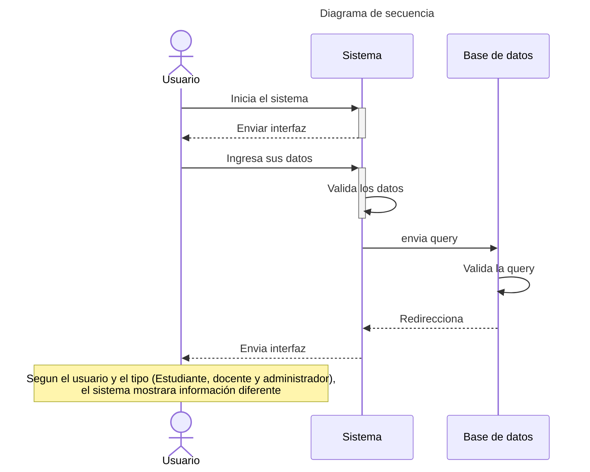
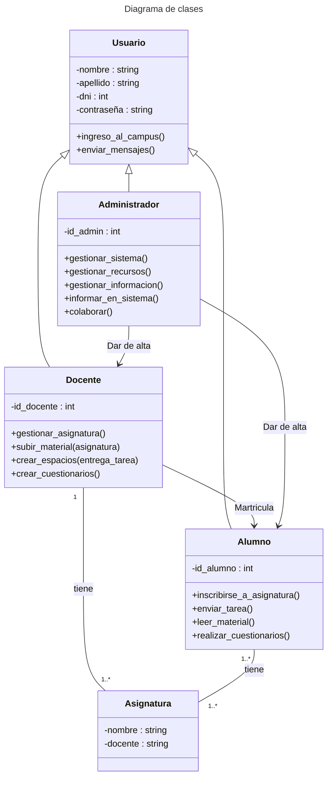

# Trabajo final de Desarrollo de Software

### Alumnos:

- Aranguiz Micaela
- Carrera Jeremias
- Folatelli Facundo
- Garcia Diego
- Gonzalez Agustin
- Orozco Mariano
- Tames Lorenzo

---

```mermaid

---
title: Diagrama de secuencia
---

sequenceDiagram

actor u as Usuario
participant s as Sistema
participant bd as Base de datos

u->>+s:Inicia el sistema
s-->>-u:Enviar interfaz
u->>+s:Ingresa sus datos
s->>-s:Valida los datos
s->>bd:envia query
bd->>bd:Valida la query
bd-->>s:Redirecciona
s-->>u:Envia interfaz
note over u:Segun el usuario y el tipo (Estudiante, docente y administrador), <br> el sistema mostrara información diferente

```

---

```mermaid

---
title: Diagrama de clases
---

classDiagram

    class Usuario{
        -nombre : string
        -apellido : string
        -dni : int
        -contraseña : string

        +ingreso_al_campus()
        +enviar_mensajes()
    }

    class Alumno{
        -id_alumno : int

        +inscribirse_a_asignatura()
        +enviar_tarea()
        +leer_material()
        +realizar_cuestionarios()
    }
    class Docente{
        -id_docente : int
        +gestionar_asignatura()
        +subir_material(asignatura)
        +crear_espacios(entrega_tarea)
        +crear_cuestionarios()
    }
    class Administrador{
        -id_admin : int

        +gestionar_sistema()
        +gestionar_recursos()
        +gestionar_informacion()
        +informar_en_sistema()
        +colaborar()
    }
    class Asignatura {
        -nombre : string
        -docente : string
    }

    Usuario<|--Alumno
    Usuario<|--Docente
    Usuario<|--Administrador

    Docente "1" -- "1..*" Asignatura : tiene
    Docente --> Alumno: Martricula
    Alumno "1..*" --  "1..*" Asignatura: tiene
    Administrador --> Alumno: Dar de alta
    Administrador --> Docente: Dar de alta


```
