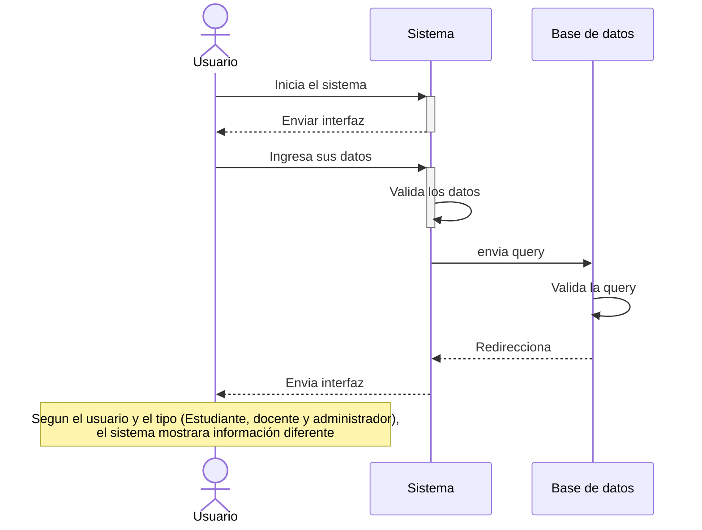
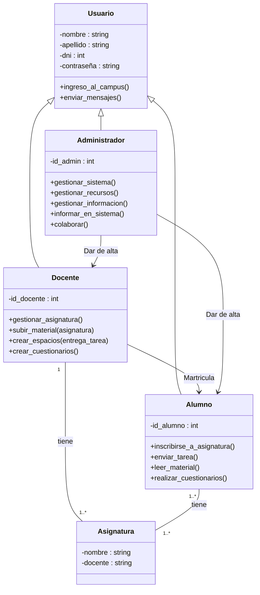

# Trabajo final de Desarrollo de Software

### Alumnos:

- Aranguiz Micaela
- Carrera Jeremias
- Folatelli Facundo
- Garcia Diego
- Gonzalez Agustin
- Orozco Mariano
- Tames Lorenzo

---
## Requerimientos

### Alumnos:

| Funcionales | No funcionales |
| :---------: | :------------: |
| Inscripción de materias | Agregar comentarios a las entregas de las tareas |
| Visualizar contenido de las materias | Abrir un foro de comunicación |
| Tener calendario de las fechas de entregas | Fácil accesibilidad |
| Hacer entregas de tareas | |
| Anotarse a materias como carreras | |

### Docentes:

| Funcionales |
| :---------: |
| Avisar sobre fechas de entrega,de parciales y de ausencia |
| Correjir notas  |
| Matricularse como docente |
| Dictar clases virtuales |

---

## Diagrama de secuencia

---
## Diagrama de clases

---

## Diagrama de estados

---

## Diagrama de casos de uso
